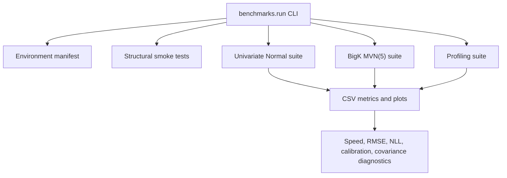

# NGBoost Speed/Accuracy Benchmarking

This document explains the benchmark suite added for the NGBoost speed work, the
most important result from the clean full run, and how to interpret the output.
It is written for maintainers deciding what to ship, not as a promise that every
fast benchmark variant is production-ready.

## Executive Summary

The safest conclusion is narrow:

- **Tree fitting dominates runtime.** In profiling, baseline `fit_base_pct`
  averaged about 72% across the profiled datasets.
- **`parallel_separate` is the production speed feature with the cleanest safety
  story.** It preserves the historical one-tree-per-distribution-parameter model
  shape and parallelizes those independent fits.
- **High-parameter distributions benefit most.** The BigK benchmark showed
  `BigK:ParallelFit` at a median 2.32x speedup with zero median NLL or RMSE
  drift relative to baseline.
- **Some benchmark-only methods are much faster but change model semantics.**
  Shared multi-output trees and pre-binned custom trees are useful research
  signals, not default production choices.
- **LightGBM results must be labeled carefully.** The 7.39x univariate median
  speedup came from the benchmark-only persistent LightGBM variant, not from the
  public `LightGBMTreeLearner` wrapper. Treat the public wrapper as an optional
  non-equivalent backend until it has direct benchmark evidence.

## Clean Benchmark Run

The main clean run used for the results below is:

```text
results/benchmarks/full_extended_safe_speed_20260506_065926
```

The run manifest reports:

| Field | Value |
| --- | --- |
| Commit | `fe073a6` |
| Dirty worktree | `false` |
| Python | 3.11.8 |
| Platform | macOS-26.4.1 arm64 |
| Threads | `OMP_NUM_THREADS=4`, `MKL_NUM_THREADS=4`, `OPENBLAS_NUM_THREADS=4`, `NUMBA_NUM_THREADS=4` |
| Suite | `full` |
| Parts | `all` |
| Univariate trials | 5 |
| BigK trials | 5 |
| Trial resplits | enabled |
| Method order | randomized deterministically |

The completed CSVs contain:

| File | Rows | Status |
| --- | ---: | --- |
| `ngboost_univariate_results.csv` | 2880 | all `ok` |
| `ngboost_bigk_results.csv` | 80 | all `ok` |
| `ngboost_profiling_results.csv` | 28 | all `ok` |

Important caveat: commit `6e41a2c` later added explicitly named public-path
benchmark specs such as `PublicParallelSeparate` and
`PublicLightGBMTreeLearner+CappedLS`. Those names are not present in the clean
`fe073a6` result CSVs. Use the `fe073a6` run as evidence for the benchmark
subclasses and overall direction; rerun from `6e41a2c` or newer before making
claims about the explicitly named public benchmark specs.

## What The Suite Runs



The suite has three main parts:

| Part | Purpose | Output |
| --- | --- | --- |
| Univariate Normal | Speed and accuracy across synthetic, sklearn, and OpenML tabular datasets | `ngboost_univariate_results.csv`, per-dataset timing plots, Pareto plots |
| BigK MVN(5) | Stress test high-parameter multivariate normal fitting | `ngboost_bigk_results.csv`, BigK scaling plots |
| Profiling | Attribute time to base fitting, line search, natural gradient, scoring, prediction, and other work | `ngboost_profiling_results.csv`, profile breakdown plots |

The full extended univariate run covered 20 datasets:

```text
Abalone, BikeSharing, CPUAct, CaliforniaHousing, Concrete, Diabetes,
Elevators, EnergyEfficiency, Heteroskedastic-10k, Kin8nm, Naval,
PowerPlant, Protein, Sulfur, Synth-10k-P32, Synth-10k-P8, Synth-25k-P8,
Synth-2k-P8, WineQualityRed, Yacht
```

Each univariate dataset used three configs:

| Config | Meaning |
| --- | --- |
| `T50_lr0.10` | 50 estimators, learning rate 0.10 |
| `T200_lr0.05` | 200 estimators, learning rate 0.05 |
| `T400_lr0.05_ES20` | 400 estimators, learning rate 0.05, early stopping patience 20 |

BigK used `MultivariateNormal(5)` with:

| Dimension | Values |
| --- | --- |
| Samples | 5000, 10000 |
| Targets | 5 |
| Features | 8 |
| Estimators | 50, 100 |
| Trials | 5 |

## Metrics

The benchmark records both runtime and predictive quality:

| Metric | Meaning |
| --- | --- |
| `Time_mean`, `Time_std` | Fit wall time across trials |
| `Speedup` | Baseline time divided by method time within the same benchmark cell |
| `RMSE_mean` | Point-prediction RMSE |
| `Delta_RMSE` | RMSE minus baseline RMSE for the same cell |
| `NLL_mean` | Negative log likelihood |
| `Delta_NLL` | NLL minus baseline NLL for the same cell |
| `PredictTime`, `PredDistTime` | Prediction timing diagnostics |
| `Time_per_stage` | Fit time divided by fitted boosting stages |
| `n_stages` | Number of fitted boosting stages, useful when early stopping is enabled |

For multivariate normal runs, the metrics also include covariance and
calibration diagnostics such as eigenvalue percentiles, condition numbers,
log determinants, non-positive-definite counts, and Mahalanobis summaries.

## Key Result Tables

### Univariate Normal

All rows below summarize 60 cells: 20 datasets times 3 configs.

| Method | Median speedup | Median Delta_NLL | p90 Delta_NLL | Cells with Delta_NLL > 0.1 | Cells with RMSE drift > 5% |
| --- | ---: | ---: | ---: | ---: | ---: |
| Baseline | 1.00x | 0.000 | 0.000 | 0.0% | 0.0% |
| `FN:Baseline` | 1.00x | 0.000 | 0.001 | 1.7% | 0.0% |
| `ParallelFit(threads)` | 1.14x | 0.000 | 0.000 | 0.0% | 0.0% |
| `CappedLS(2up+3dn)` | 1.00x | 0.000 | 0.000 | 0.0% | 0.0% |
| `MO` | 1.88x | 0.013 | 0.225 | 21.7% | 21.7% |
| `MO+FixedStep` | 1.97x | 0.031 | 0.227 | 26.7% | 25.0% |
| `PreBinnedNumba+FixedStep` | 3.77x | 0.038 | 0.206 | 28.3% | 41.7% |
| `LightGBM+CappedLS` | 7.39x | -0.004 | 0.010 | 0.0% | 0.0% |
| `LightGBM+FixedStep` | 9.52x | -0.001 | 0.067 | 5.0% | 8.3% |

Interpretation:

- `ParallelFit(threads)` is exact but not a broad univariate speed win. Normal
  has only two parameters, so joblib overhead can erase the benefit.
- `FN:Baseline` validates the inlined Normal log-score/natural-gradient path as
  a low-risk internal optimization. It is not a large fit-time speedup in the
  full univariate suite.
- `MO` and `PreBinnedNumba` are fast enough to study further, but their
  regression rates make them benchmark-only.
- The strong LightGBM numbers are encouraging, but they are not evidence for the
  public `LightGBMTreeLearner` wrapper until that wrapper is benchmarked
  directly.

### BigK MVN(5)

All rows below summarize four cells: N in `{5000, 10000}` times T in `{50, 100}`.

| Method | Median speedup | Median Delta_NLL | Median RMSE drift |
| --- | ---: | ---: | ---: |
| `BigK:ParallelFit` | 2.32x | 0.00 | 0.0% |
| `BigK:MO` | 5.45x | -1.14 | -26.8% |
| `BigK:MO+FixedStep` | 6.47x | -1.13 | -26.7% |
| `BigK:MO+CappedLS` | 5.37x | -1.14 | -26.8% |
| `BigK:PreBinnedNumba+FixedStep` | 8.20x | -1.10 | -26.6% |
| `BigK:MO+DiagNG` | 7.88x | 0.79 | 39.6% |

Interpretation:

- `BigK:ParallelFit` is the strongest production signal because it matches
  baseline metrics while reducing wall time.
- Shared multi-output trees and pre-binned custom trees are much faster and even
  look better on this synthetic BigK design, but they change the model. They are
  promising research paths, not drop-in safe optimizations.
- `BigK:MO+DiagNG` is fast but has a large accuracy regression in this run.

### Profiling

The profiling suite supports the runtime diagnosis:

| Method | Mean `fit_base_pct` | Median total seconds |
| --- | ---: | ---: |
| Baseline | 72.0% | 3.28 |
| NoCopy | 72.3% | 3.26 |
| NoCopy+CappedLS | 72.3% | 3.26 |
| MO | 72.2% | 1.74 |
| MO+CappedLS | 72.8% | 1.75 |
| MO+HybridLS | 71.9% | 1.72 |
| MO+GradNorm | 70.6% | 1.80 |

Interpretation:

- Avoiding copies is not enough; base learner fitting dominates.
- The best safe speed feature targets independent base fits, which is exactly
  what `parallel_separate` does for high-parameter distributions.

## Method Taxonomy

### Production-safe or near-safe

| Feature | Status | Why |
| --- | --- | --- |
| Inlined Normal logpdf/log-score | Keep | Mathematically equivalent for the Normal LogScore path and covered by equivalence tests |
| Exact Normal diagonal natural gradient | Keep | Exact for Normal LogScore Fisher structure |
| `fit_base_mode="parallel_separate"` | Keep, opt-in | Preserves separate per-parameter learners for deterministic, thread-safe base learners |

### Optional but behavior-changing

| Feature | Status | Why |
| --- | --- | --- |
| `line_search_strategy="loss_checked_capped"` | Opt-in | Enforces a checked-batch loss guard, but changes optimization behavior |
| `LightGBMTreeLearner` | Optional backend | Changes tree construction semantics and needs direct public-path benchmarks |

### Benchmark-only

| Feature family | Why not production default |
| --- | --- |
| Shared multi-output trees (`MO`) | Changes split selection by fitting one tree for multiple distribution parameters |
| FixedStep variants | Can alter convergence and calibration substantially |
| PreBinnedNumba | Custom tree omits production concerns such as mature missing-value, sparse, and weighting semantics |
| Generic DiagNG/GlobalNG | Accuracy and calibration are not consistently safe |
| NewtonLeaves and Fisher heuristics | Interesting research directions, not proven defaults |
| Persistent LightGBM benchmark estimator | Different implementation from public `LightGBMTreeLearner` |

## Recommended Benchmark Commands

Install benchmark dependencies:

```sh
poetry install --with bench
```

Short smoke-style benchmark:

```sh
python -m benchmarks.run --suite short --part all --no-show-plots
```

Full extended benchmark:

```sh
python -m benchmarks.run \
  --suite full \
  --part all \
  --include-extended-datasets \
  --trials 5 \
  --bigk-trials 5 \
  --resplit-trials \
  --output-dir results/benchmarks/full_extended_safe_speed_$(date +%Y%m%d_%H%M%S) \
  --no-show-plots
```

Focused public-path rerun after commit `6e41a2c` or newer:

```sh
python -m benchmarks.run \
  --suite full \
  --part all \
  --include-extended-datasets \
  --trials 5 \
  --bigk-trials 5 \
  --resplit-trials \
  --methods Baseline,PublicParallelSeparate,BigK:Baseline,BigK:PublicParallelSeparate,PublicLightGBMTreeLearner+CappedLS \
  --output-dir results/benchmarks/public_speed_paths_$(date +%Y%m%d_%H%M%S) \
  --no-show-plots
```

## Evidence Hygiene

Before publishing a benchmark claim:

1. Confirm `env_manifest.json` has `"dirty": false`.
2. Confirm the manifest commit is the commit being cited.
3. Confirm optional backends are labeled by implementation, not just library.
4. Separate fixed-stage throughput results from early-stopping end-to-end results.
5. Report thread settings and avoid comparing single-threaded CART against
   multi-threaded backends without saying so.
6. Use public API benchmark specs for public API claims.

## Maintainer Recommendation

For production guidance:

- Use historical defaults for ordinary univariate Normal work.
- Use `fit_base_mode="parallel_separate"` for multivariate or otherwise
  high-parameter distributions when the base learner is deterministic and
  thread-safe.
- Consider `LightGBMTreeLearner` only as an optional non-equivalent backend that
  must be validated per dataset.
- Keep MO/shared-tree and PreBinnedNumba paths in `benchmarks/variants.py`.

